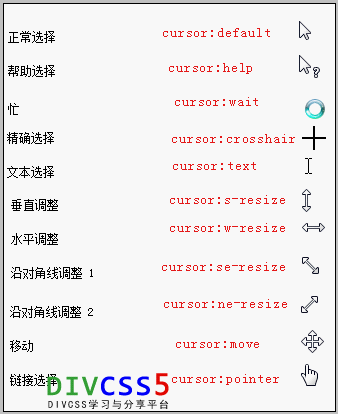

#CSS
---


#less
[lessc](http://www.th7.cn/web/html-css/201308/11926.shtml)

---
#布局
[4种方法实现边栏固定中间自适应的3栏布局](https://segmentfault.com/a/1190000002664237)
[老生长谈：CSS实现右侧固定宽度，左侧宽度自适应](http://jo2.org/css-auto-adapt-width/)


#cursor语法
cursor : auto | crosshair | default | hand | move | help | wait | text | w-resize |s-resize | n-resize |e-resize | ne-resize |sw-resize | se-resize | nw-resize |pointer | url (url)

##常用cursor光标说明
1）、div{ cursor:default }默认正常鼠标指针
2）、div{ cursor:hand }和div{ cursor:text } 文本选择效果
3）、div{ cursor:move } 移动选择效果
4）、div{ cursor:pointer } 手指形状 链接选择效果
5）、div{ cursor:url(url图片地址) }设置对象为图片        


##鼠标指针说明
cursor设置或检索在对象上移动的鼠标指针采用何种系统预定义的光标形状。

##布局结构
```html
p { cursor: text; } /* css注释： 设置鼠标移动到html p对象时鼠标变为文本选择样式 */
a { cursor: pointer; } /* css注释： 设置鼠标移动到a超链接对象时鼠标变为手指形状（链接选择） */
body { cursor: url("小图片地址")} /* 设置鼠标指针默认为一个小图片 */
```


#引入
```
#element上定义

#页面内定义
<style type="text/css">
    body{
      margin:20 0 0 0;
    }
</style>
#css文件内定义
<link rel="stylesheet" href="{{ static_url('js/lib/bootstrap/dist/css/bootstrap.min.css') }}"/>


```

-----
#圆角矩形
border-radius: 5px; /* 所有角都使用半径为5px的圆角，此属性为CSS3标准属性 */
-moz-border-radius: 5px; /* Mozilla浏览器的私有属性 */
-webkit-border-radius: 5px; /* Webkit浏览器的私有属性 */
border-radius: 5px 4px 3px 2px; /* 四个半径值分别是左上角、右上角、右下角和左下角 */
##ie hack
纯css http://blog.csdn.net/wangxiaohui6687/article/details/7678661
IE .htc http://www.iefans.net/ie-css3-yuanjia/
css3 

---
#效果
##透明
http://paranimage.com/css-transparent-attribute/
##阴影 
http://blog.csdn.net/freshlover/article/details/7610269
jquery 实现 http://www.bitstorm.org/jquery/shadow-animation/

---
#div
[子Div使用Float后如何撑开父Div](http://www.cnblogs.com/suntop/archive/2010/09/16/1828052.html)


