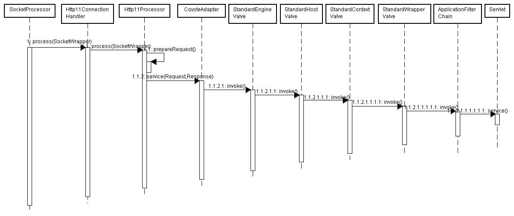

```java
	//public class JIoEndpoint extends AbstractEndpoint<Socket> 
	@Override
    public void startInternal() throws Exception {

        if (!running) {
            running = true;
            paused = false;

            // Create worker collection
            if (getExecutor() == null) {
                createExecutor();
            }
            initializeConnectionLatch();//init LimitLatch
            startAcceptorThreads();
            // Start async timeout thread  超时检测 ConcurrentLinkedQueue<SocketWrapper<Socket>>  waitingRequests
            Thread timeoutThread = new Thread(new AsyncTimeout(),
                    getName() + "-AsyncTimeout");
            timeoutThread.setPriority(threadPriority);
            timeoutThread.setDaemon(true);
            timeoutThread.start();
        }
    }
    //启动Acceptor线程
    protected final void startAcceptorThreads() {
        int count = getAcceptorThreadCount();
        acceptors = new Acceptor[count];
        for (int i = 0; i < count; i++) {
            acceptors[i] = createAcceptor();
            String threadName = getName() + "-Acceptor-" + i;
            acceptors[i].setThreadName(threadName);
            Thread t = new Thread(acceptors[i], threadName);
            t.setPriority(getAcceptorThreadPriority());
            t.setDaemon(getDaemon());
            t.start();
        }
    }
```

acceptorThreadCount个线程，每个线程由Acceptor代理，具体看看Acceptor的run方法
```java
	protected class Acceptor extends AbstractEndpoint.Acceptor {

        @Override
        public void run() {

            int errorDelay = 0;

            // Loop until we receive a shutdown command
            while (running) {

                // Loop if endpoint is paused
                while (paused && running) {
                    state = AcceptorState.PAUSED;
                    try {
                        Thread.sleep(50);
                    } catch (InterruptedException e) {
                        // Ignore
                    }
                }

                if (!running) {
                    break;
                }
                state = AcceptorState.RUNNING;

                try {
                    //if we have reached max connections, wait
                    countUpOrAwaitConnection();

                    Socket socket = null;
                    try {
                        // Accept the next incoming connection from the server
                        // socket
                        socket = serverSocketFactory.acceptSocket(serverSocket);
                    } catch (IOException ioe) {
                        countDownConnection();
                        // Introduce delay if necessary
                        errorDelay = handleExceptionWithDelay(errorDelay);
                        // re-throw
                        throw ioe;
                    }
                    // Successful accept, reset the error delay
                    errorDelay = 0;

                    // Configure the socket
                    if (running && !paused && setSocketOptions(socket)) {
                        // Hand this socket off to an appropriate processor
                        if (!processSocket(socket)) {
                            countDownConnection();
                            // Close socket right away
                            closeSocket(socket);
                        }
                    } else {
                        countDownConnection();
                        // Close socket right away
                        closeSocket(socket);
                    }
                } catch (IOException x) {
                    if (running) {
                        log.error(sm.getString("endpoint.accept.fail"), x);
                    }
                } catch (NullPointerException npe) {
                    if (running) {
                        log.error(sm.getString("endpoint.accept.fail"), npe);
                    }
                } catch (Throwable t) {
                    ExceptionUtils.handleThrowable(t);
                    log.error(sm.getString("endpoint.accept.fail"), t);
                }
            }
            state = AcceptorState.ENDED;
        }
    }
```





