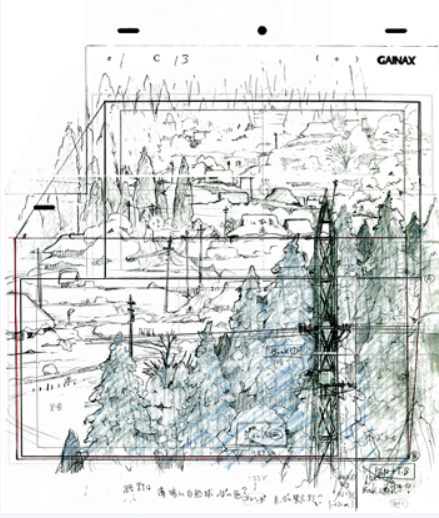

# 构图

# 13 动画的消失点和透视线的必要性 
http://blog.sina.com.cn/s/blog_765107050102wl0a.html
8：动画的消失点和透视线的必要性
提问者4：“平松先生的演出特征是什么时候固定的？“

我还没打算固定呢（笑）。

一开始的时候我只要能画画，只要能让画面动起来就觉得有趣，这个时候我所使用的演出手法和我从事演出的工作后所使用的手法是略有不同的。大概是在参与了《人狼》的制作之后，我的演出手法才有了很大变化吧。不过变化的可能只是构图的画法。

最让我感到画构图的有趣之处的是日本动画*（译注：以下简称日动）的世界名作剧场。《罗密欧的天空》、《七海小英雄》、《名犬莱西》等等，我的演出特征的基础应该就是在制作这些作品时打下的。
*日本动画：日本动画公司（日本アニメーション株式会社；Nippon Animation Co., Ltd.），成立于1975年，前身为瑞鹰，以制作世界名作剧场而闻名于世。

现在大家在画构图的时候经常会在画面上画满透视线，但是日动的画师则不同，他们画的透视线比较松散。应该是一点透视的时候，他们的构图里却有两个消失点或是一个都没有（笑）。

消失点图解

GAINAX动画讲义第十三回——动画的消失点和透视线的必要性

A：从设定的消失点开始画透视线的例子  绿字：视线高度 红字：透视线

A图的视角稍微偏向房间右侧，桌子前方的线从左往右向内部延伸。桌面看起来比较宽，地板也能看见很多。镜头感强，视线高度类似于俯瞰，强调了房间进深，看上去有点像广角镜头。

GAINAX动画讲义第十三回——动画的消失点和透视线的必要性

B：虽然视线高度相同却没有明确的消失点的例子  蓝字：消失点大致就分布在这里。
B图桌子前方的线接近水平，桌面较为狭窄，地板能看到的地方也变少了。进深稍被压缩，内部的两个人也比A大。虽然视线高度相同，但是B的俯瞰感较轻，是不真实的望远镜头。

“当优先考虑视觉的安定感而不是镜头的准确性的时候，我个人会用B的方法”（平松）

用摄像机拍摄景物的时候，透视线是很明显就能看出来的。把眼中看到的景象进行压缩之后肯定会出现透视线，但是当你用自己的肉眼来看的时候，就感觉来讲，透视线并不是很明显就能看出来的，你会意外地发现它比较松散。

在《人狼》制作期间我和西尾君还有沖浦先生一起工作过，当时我就从他们身上感受到了一种文化差异，因为我发现他们竟然都把透视线画得非常准确，我还是第一次发现有那种画法。即使现在我都没想过要把透视线画得那么准确。这个就是画出镜头中看到的景象，和画出自己眼里看到的景象的不同之处。现在大家在画的时候都是设置好消失点和视线高度来画透视线的，这当然是必要的，但是大家不妨也试一下把透视线画乱。

比如说在画箱子的透视图的时候，大家一般都是先设置好消失点和透视线，然后再来想像放在某个地方的箱子看上去应该是怎样的。如果是我的话，我会先在自己脑子里想像之后再画出来，而不会采用从消失点来考虑的方法。**如果把透视线画得非常准确的话，当把透视线擦掉的时候，画面就会显得很狭窄，或者说看上去很死板。**

根据透视线来画的时候，房间的天花板和墙壁的交线也是向消失点的方向延伸的，这样的话在我们今天的题目里，这个房间就会显得很狭窄。从正上方看的时候房间就不是正方形而是梯形了。为了避免出现这种情况，我们就应该让透视线稍微偏离消失点，而不是一定要用尺子画出透视线，再来观察画面在空间上是否合理。

另外，在对于透视线的说明中，我们经常能看到像栅栏一样均等地向画面内部连续排列的图案。在《人狼》制作期间我就画过这种构图，当时一开始的时候我也很紧张，觉得一定要画得很准确才行，然后就完全按教科书的方法去画了。但是在画的过程中我发现这仅仅是在浪费时间，完全没有意义。这种事只要做过一次你就会明白了，以后你也没必要再这么做。即使在计算的时候是正确的，但是实际上不再往内部延伸的话是很难表现出均等的感觉的。所以大家不要盲目轻信消失点和透视线……这就是我在日动的工作中学到的东西。

## 9：画面的准确性和氛围
大家知道《妙手小厨师》吗？这部作品的人设加濑政广先生也是日动出身。他画的构图里面真的没有消失点。我记得他曾画过一个有房间入口的阁楼的构图，结果无论他从什么角度来画，他的构图里都没有消失点，但作为画面来看，他的构图却是成立的。

同样的例子，郁特里罗有一幅名叫《コタン小路》的竖向的画。画面里面，道路两旁的建筑物给人一种很高的感觉，为什么呢？就是因为这幅画的透视线画得并不正确。如果准确地画透视线的话，这些建筑看起来就不会那么高了。

[コタン小路](../../Img/ani/コタン小路.png)

观察也是同样的道理，希望大家能去观察各种各样的东西，比如美术品、照片、实拍电影等等。当这些东西让你产生了某种感觉的时候，你就要思考和想像为什么它会让我产生这种感觉。这也需要反复练习。

这些就是我在日动的时候考虑得最多的东西。比如当我用尺子来画欧洲的街道的时候，却发现画出来的东西和我想像的不同，所以我就不用尺而是全部徒手来画。这和我刚才讲的使透视线偏离消失点的方法一样，能产生一种手工制作的感觉。不过如果要画城市中心高楼耸立的画面的话可能就不一样了。

**透视线是否需要画得准确要看具体情况而定。但是首先你必须知道你想要画什么，然后再来选择工具和方法。**总之，我在日动的时候意识到的一点就是透视线并不是一定要画得很准确。

然后，在制作《人狼》的时候，我的画法又回到了不把透视线画得过于松散的风格。《妙手下厨师》的时候我画得实在太任性了（笑）。当然原画画得好是一部分原因，但主要还是因为我没怎么考虑构图的事，我觉得只要画得又酷又炫的就行了。经过这种玩闹的工作之后我就参与了日动作品的制作，画了《人狼》和《INNOCENCE》那样的精确的构图。最后我的结论就是参与了各种涉及面很广的工作之后，自己的思考会变得更有深度。

能参与各种不同类型的作品的制作还是很不错的。比如说在做了有很多动作镜头的《天元突破》的之后，再去做像日动作品一样的有很多日常情节的作品的话，应该是会学到很多东西的。

---
# 第十四回 作画精细的重要性 
## 10：画面精细的重要性
提问者5：“关于作画的精细程度，比如《飞跃巅峰2！》的构图都画得非常精细，请问这有什么意义呢？”

我想那是因为原画师想要画所以就画出来了（笑）。

我觉得大家只要按自己的想法来画就行了。虽然根据电视动画、剧场版、OVA等媒体的不同，作画的精细程度是有所差别的，但并不是说因为是剧场版所以一定要画得很精细，或者因为电视动画所以就画得粗糙一点。这毕竟是和时间和金钱有关的，做法可能因人而异吧。如果让你用剧场版的作画密度来画电视动画的20个镜头的话，你可能连饭钱都挣不到了。所以你可以把某些镜头画得简洁一点，某些镜头则画得精细一点，这就只能由你自己来筛选。

《飞跃巅峰2！》和《天元突破》就是这样，每个原画师所负责的镜头都很少，所以每个人都画得很努力，很精细。只画5个镜头的画师会把这5个镜头都画得很好，所以《飞跃巅峰2！》和《天元突破》的每个镜头看上去都很细致。

其实比起画师的想法，是否需要精细作画还得看整体制作的 **日程和状况**。最近我就发现一些电视动画的作画密度都很高，这就是因为每个画师所负责的镜头数都很少的原因。但实际上在选择镜头的时候，应该让演出，或是制作进行、原画师经过思考之后挑出三十到四十个镜头，然后演出就在和原画师讨论的时候，告诉原画师哪些镜头需要画得很细致，比如说：“这个镜头很重要，你最好把细节都画出来，这个镜头的话则可以稍微画得简单一点。”因为也有一些物理上的原因，所以你不可能在所有镜头上花费太多时间，这时候你就需要掌握好平衡了，比如说对于一些很重要的镜头，你可以一天只画一个，而对于那些相对不重要的镜头，你可以一天画五六个。这样的话整部作品看起来就不会那么费力，观众也能更加感受到你的努力。

## 11：第一原画
最近大家在构图阶段就开始填律表了。因为日程上并没特别为构图安排时间，所以大家都习惯把构图画成第一原画*。
*第一原画，原文“ラフ原”，和“一原”同义。意指用比较粗糙的画画出大致的动作的构图——GAINAX动画讲义用语集。由于制作工程和原画作业的时间安排非常紧张，所以会出现由原本的原画师画出粗糙的原画之后，再由其他原画师对其描线，把它画成清晰的原画的情况。前者被称为第一原画（一原），后者被称为第二原画（二原）——日文维基“原画”词条

但实际上没必要这么做。首先你只要把背景准确地画出来，然后再把角色的关键动作和重要的地方传达给演出，那么它作为构图就是成立的。GAINAX有很多画师把构图画得和第一原画差不多，这虽然没什么不好，但是如果在这上面花费太多时间的话，画原画的时间就不够了，这样的话演出的检查也只能延后。经常如此的话，整部作品的制作日程都会延后。

对于动作很简单的镜头，你只要画一张带有背景和角色的构图，然后用箭头来指示动作就行，剩下的时间就用来画原画吧。即使只有箭头，只要背景画得对，那么演出或作监也是能把角色的动作想像出来的。只不过，如果分镜画了两格，那么构图也至少需要画两张。如果分镜画了五格，但是你的构图只有三张的话，那么演出或作监就会觉得你在偷懒了（笑）。相反的，如果分镜画得很潦草，但是你的构图画得很细致从而表现出了场景的氛围的话，就演出来讲，你的构图不会给人很差的感觉。因为演出会检查原画师是否把真正把分镜的内容想像了出来，如果你画错了就得修改，所以没必要把构图画成第一原画。

----
# 第十五回 构图的平衡
## 12 构图的平衡
对于今天的这个题目，很多人都想知道“标准答案”。其实从评价者的角度来看的话，演出首先会看人物和物体的配置是否平衡。然后还会观察在你画的背景上，角色是否能做出分镜所要求的动作。

就我来说，对于人物的配置，如果画面是标准尺寸的话，我基本上是不怎么在意的。而如果画面是远景尺寸的话，我就会比较注意了。比如说要在画面上画人物的腰部以上的部位的时候，如果是标准尺寸的话，即使头部有一小部分在画面以外也不会觉得不正常，而如果头部全部都在画面之内的话反而会有一种奇怪的感觉。这种配置就有点不伦不类，所以我觉得把头部露出外面一点的配置方法是比较好的。

GAINAX动画讲义第十五回——构图的平衡

红框：标准尺寸（standard size） 绿框：远景尺寸（vista size）

※图片来自ゆんフリー写真素材集

但是，如果在远景尺寸的画面上也这么画的话，因为画面横向较长，所以人物就把画面一分为二，左右两边会留下很多空隙，看上去就会很不舒服。所以在

       远景尺寸的画面中，人物头部的上方是空着的，实拍片也是如此。也就是说如果画面尺寸不怎么窄，比较宽松的话，把人物头部上方空出来的配置方式是比较好的。当然这还要考虑到画面是否容易看懂，和其在演出上的意义，不过演出首先看的就是你的配置。

       下面我要讲的可能跑题了，以前我在积累了一定程度的原画经验之后，曾和某位演出家合伙工作了很长时间。当时我经常做的一件事就是描分镜。因为那位演出家不擅长作画，所以他画分镜用草图的时候，只是在A4纸上用圆圈和点来作画，台词也是有时候写有时候不写。然后他就把他画的草图给我，我一边看脚本一边些台词，一边看设定一边画背景。某种意义上来说，我做的工作和把一整话的构图都画下来差不多。因为时间紧张，所以我要在半熬夜状态下画整整两天才能画完。不过在一边和演出进行密切的交流，一边集中精力进行作业的过程中，我的确学到了很多东西。

GAINAX动画讲义第十五回 构图的平衡

分镜用草图例（平松氏为举例画出）
总而言之，最重要的一点就是你能否从分镜用的草图中想像出最终的完成画面。当根据非常潦草的分镜来画构图的时候，我不会先画透视线。如果有三个角色的话，我会先画头的位置并控制角色的平衡，然后再来考虑视线高度。当镜头里有人物的时候，我的处理顺序就是先考虑人物的配置，然后再来设置背景和物体以使人物的配置成立。

理解镜头的内容也是画构图时需要做到的一件事。构图并不只是单纯地将分镜的画面再现出来，画之前你必须要思考为什么用这种画面尺寸和这种角度来画。即使你不想担任演出，你也必须要知道对作画来说，能够理解演出是非常重要的一个条件。

为了理解演出而需要的东西，就是我今天一直提到的“对各种物体的观察”，和“把它们组合在一起的想像力”。正如我刚才讲的一样，画构图的时候只要能把意图传达给演出的话，就没必要把构图画成第一原画。你的构图是否易于理解，你画的时候态度如何，你对分镜中的演出方面的东西理解了多少，这些就是演出要看的东西。

在画构图的时候，大家还需要从各种信息中区分出必要的信息和不必要的信息。为了进行信息的筛选，大家就需要不断地观察，训练观察物体的方法，然后在脑中积累各种形象再来画，需要资料的话就去搜集资料。

所以说重要的就是每天的训练！努力！和毅力！（笑）

虽说如此，我们也是因为喜欢才干这一行的。带着素描本去外面画可能需要相当大的勇气吧，不过一旦你习惯之后，你就会发现这其实挺有意思的。

希望大家能开开心心地画。
平松祯史先生的《GAINAX动画讲义：构图》于本回结束。

对于今后想进入动画行业的人，和实际在进行作业的制作者们来说，如果本讲义能让你们对动画影像制作中“构图作业”的意义和重要性有所理解的话，我们会感到非常高兴。感谢大家的阅读。

