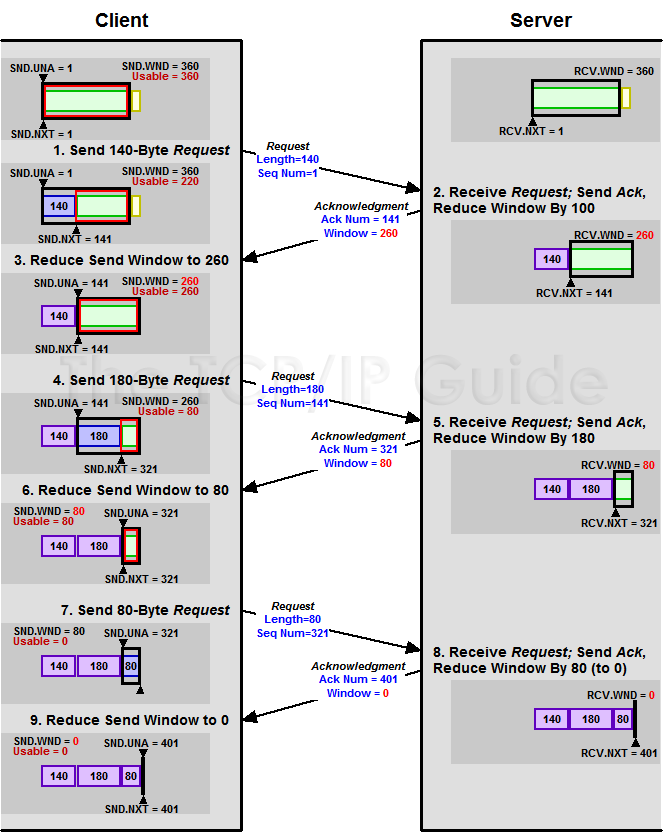

#TCP 协议
---
#docs
[TCP 的那些事儿（上）](http://coolshell.cn/articles/11564.html)
[TCP 的那些事儿(下)](http://coolshell.cn/articles/11609.html)
[TCP协议中的三次握手和四次挥手(图解)](http://blog.csdn.net/whuslei/article/details/6667471)


---
#协议字段
##协议包头
| source port	 | destination port 	|
| sequence number 						|
| acknowledgment number 				|
|offset | reserved | TCP Flags | window |
| checksum 		   |  urgent pointer	|
|	TCP Options(variable length,optional)|
注意这么几点：
* TCP的包是没有IP地址的，那是IP层上的事。但是有源端口和目标端口。
* 一个TCP连接需要四个元组来表示是同一个连接（src_ip, src_port, dst_ip, dst_port）准确说是五元组，还有一个是协议。但因为这里只是说TCP协议，所以，这里我只说四元组。
* 注意上图中的四个非常重要的东西：
	- Sequence Number是包的序号，用来解决网络包乱序（reordering）问题，[增加是和传输的字节数相关的]
	- Acknowledgement Number就是ACK——用于确认收到，用来解决不丢包的问题。
	- Window又叫Advertised-Window，也就是著名的滑动窗口（Sliding Window），用于解决流控的。
	- TCP Flag ，也就是包的类型，主要是用于操控TCP的状态机的。

##TCP Flags
C 0x80 Congestion Windows Reduced(CWR)
E 0x40 ECN Echo (ECE)
U 0x20 Urgent
A 0x10 Ack
P 0x08 Push
R 0x04 Reset
S 0x02 Syn
F 0x01 Fin

##状态机


---
#协议流程
[TCP协议中的三次握手和四次挥手(图解)](http://blog.csdn.net/whuslei/article/details/6667471)

##三次握手
对于建链接的3次握手，主要是要初始化Sequence Number 的初始值。通信的双方要互相通知对方自己的初始化的Sequence Number（缩写为ISN：Inital Sequence Number）——所以叫SYN，全称Synchronize Sequence Numbers。也就上图中的 x 和 y。这个号要作为以后的数据通信的序号，以保证应用层接收到的数据不会因为网络上的传输的问题而乱序（TCP会用这个序号来拼接数据。

第一次握手发送一个序列号；
第二次握手的序列号是单独发送的，第二次握手的确认号是第一次握手序列号+1；
第三次握手的序列号是第二次握手的确认号，第三次握手的确认号是是第二次握手的序列号+1；
```
                                  发送                  确认
第一次：SYN=1       SEQ=X               ACK=0（客）
第二次：SYN=1       SEQ=Y              ACK=X+1（服）
第三次：                  SEQ=X+1          ACK=Y+1（客）
SYN 同步位
```
在TCP/IP协议中，TCP协议提供可靠的连接服务，采用三次握手建立一个连接。
第一次握手：建立连接时，客户端发送syn包(syn=j)到服务器，并进入SYN_SEND状态，等待服务器确认； 
第二次握手：服务器收到syn包，必须确认客户的SYN（ack=j+1），同时自己也发送一个SYN包（syn=k），即SYN+ACK包，此时服务器 进入SYN_RECV状态； 第三次握手：客户端收到服务器的SYN＋ACK包，向服务器发送确认包ACK(ack=k+1)，此包发送完毕，客户端和服务器进入 ESTABLISHED状态，完成三次握手。 完成三次握手，客户端与服务器开始传送数据.


实例:
IP 192.168.1.11敏感词37 > 192.168.1.123.7788: S 3626544836:3626544836
IP 192.168.1.123.7788 > 192.168.1.11敏感词37: S 1739326486:1739326486 ack 3626544837
IP 192.168.1.11敏感词37 > 192.168.1.123.7788: ack 1739326487,ack 1
第一次握手：192.168.1.116发送位码syn＝1,随机产生seq number=3626544836的数据包到192.168.1.123,192.168.1.123由SYN=1知道192.168.1.116要求建立联机;
第二次握手：192.168.1.123收到请求后要确认联机信息，向192.168.1.116发送ack number=3626544837,syn=1,ack=1,随机产生seq=1739326486的包;
第三次握手：192.168.1.116收到后检查ack number是否正确，即第一次发送的seq number+1,以及位码ack是否为1，若正确，192.168.1.116会再发送ack number=1739326487,ack=1，192.168.1.123收到后确认seq=seq+1,ack=1则连接建立成功。

即：第三次发送的序列号是第二次发的确认号，第三次发送的确认号是第二次发送序列号+1； 

##四次挥手
对于4次挥手，其实你仔细看是2次，因为TCP是全双工的，所以，发送方和接收方都需要Fin和Ack。只不过，有一方是被动的，所以看上去就成了所谓的4次挥手。如果两边同时断连接，那就会就进入到CLOSING状态，然后到达TIME_WAIT状态。


有几个事情需要注意一下：
* 关于建连接时SYN超时 		 
试想一下，如果server端接到了clien发的SYN后回了SYN-ACK后client掉线了，server端没有收到client回来的ACK，那么，这个连接处于一个中间状态，即没成功，也没失败。于是，server端如果在一定时间内没有收到的TCP会重发SYN-ACK。在Linux下，默认重试次数为5次，重试的间隔时间从1s开始每次都翻售，5次的重试时间间隔为1s, 2s, 4s, 8s, 16s，总共31s，第5次发出后还要等32s都知道第5次也超时了，所以，总共需要 1s + 2s + 4s+ 8s+ 16s + 32s = 2^6 -1 = 63s，TCP才会把断开这个连接。

* 关于SYN Flood攻击 		
一些恶意的人就为此制造了SYN Flood攻击——给服务器发了一个SYN后，就下线了，于是服务器需要默认等63s才会断开连接，这样，攻击者就可以把服务器的syn连接的队列耗尽，让正常的连接请求不能处理。
于是，Linux下给了一个叫tcp_syncookies的参数来应对这个事——当SYN队列满了后，TCP会通过源地址端口、目标地址端口和时间戳打造出一个特别的Sequence Number发回去（又叫cookie），如果是攻击者则不会有响应，如果是正常连接，则会把这个 SYN Cookie发回来，然后服务端可以通过cookie建连接（即使你不在SYN队列中）。
请注意，请先千万别用tcp_syncookies来处理正常的大负载的连接的情况。因为，synccookies是妥协版的TCP协议，并不严谨。对于正常的请求，你应该调整三个TCP参数可供你选择，
第一个是：tcp_synack_retries 可以用他来减少重试次数；
第二个是：tcp_max_syn_backlog，可以增大SYN连接数；
第三个是：tcp_abort_on_overflow 处理不过来干脆就直接拒绝连接了。

* 关于ISN的初始化 		
ISN是不能hard code的，不然会出问题的——比如：
如果连接建好后始终用1来做ISN，如果client发了30个segment过去，但是网络断了，于是 client重连，又用了1做ISN，但是之前连接的那些包到了，于是就被当成了新连接的包，此时，client的Sequence Number 可能是3，而Server端认为client端的这个号是30了。全乱了。RFC793中说，ISN会和一个假的时钟绑在一起，这个时钟会在每4微秒对ISN做加一操作，直到超过2^32，又从0开始。这样，一个ISN的周期大约是4.55个小时。
因为，我们假设我们的TCP Segment在网络上的存活时间不会超过Maximum Segment Lifetime（缩写为MSL - Wikipedia语条），所以，只要MSL的值小于4.55小时，那么，我们就不会重用到ISN。

* 关于 MSL 和 TIME_WAIT
通过上面的ISN的描述，相信你也知道MSL是怎么来的了。我们注意到，在TCP的状态图中，从TIME_WAIT状态到CLOSED状态，有一个超时设置，这个超时设置是 2*MSL（RFC793定义了MSL为2分钟，Linux设置成了30s）
为什么要这有TIME_WAIT？为什么不直接给转成CLOSED状态呢？
主要有两个原因：
1）TIME_WAIT确保有足够的时间让对端收到了ACK，如果被动关闭的那方没有收到Ack，就会触发被动端重发Fin，一来一去正好2个MSL，
2）有足够的时间让这个连接不会跟后面的连接混在一起（你要知道，有些自做主张的路由器会缓存IP数据包，如果连接被重用了，那么这些延迟收到的包就有可能会跟新连接混在一起）。
你可以看看这篇文章《TIME_WAIT and its design implications for protocols and scalable client server systems》
关于TIME_WAIT数量太多。从上面的描述我们可以知道，TIME_WAIT是个很重要的状态，但是如果在大并发的短链接下，TIME_WAIT 就会太多，这也会消耗很多系统资源。只要搜一下，你就会发现，十有八九的处理方式都是教你设置两个参数，
一个叫tcp_tw_reuse，
另一个叫tcp_tw_recycle的参数
这两个参数默认值都是被关闭的，后者recyle比前者resue更为激进，resue要温柔一些。另外，如果使用tcp_tw_reuse，必需设置tcp_timestamps=1，否则无效。这里，你一定要注意，打开这两个参数会有比较大的坑——可能会让TCP连接出一些诡异的问题（因为如上述一样，如果不等待超时重用连接的话，新的连接可能会建不上。正如官方文档上说的一样“It should not be changed without advice/request of technical experts”）。

	- 关于tcp_tw_reuse  		
	官方文档上说tcp_tw_reuse 加上tcp_timestamps（又叫PAWS, for Protection Against Wrapped Sequence Numbers）可以保证协议的角度上的安全，但是你需要tcp_timestamps在两边都被打开（你可以读一下tcp_twsk_unique的源码 ）。我个人估计还是有一些场景会有问题。

	- 关于tcp_tw_recycle 		
	如果是tcp_tw_recycle被打开了话，会假设对端开启了tcp_timestamps，然后会去比较时间戳，如果时间戳变大了，就可以重用。但是，如果对端是一个NAT网络的话（如：一个公司只用一个IP出公网）或是对端的IP被另一台重用了，这个事就复杂了。建链接的SYN可能就被直接丢掉了（你可能会看到connection time out的错误）（如果你想观摩一下Linux的内核代码，请参看源码 tcp_timewait_state_process）。

	- 关于tcp_max_tw_buckets 			
	这个是控制并发的TIME_WAIT的数量，默认值是180000，如果超限，那么，系统会把多的给destory掉，然后在日志里打一个警告（如：time wait bucket table overflow），官网文档说这个参数是用来对抗DDoS攻击的。也说的默认值180000并不小。这个还是需要根据实际情况考虑。


---
#重传机制
TCP要保证所有的数据包都可以到达，所以，必需要有重传机制。
SeqNum和Ack是以字节数为单位，所以ack的时候，不能跳着确认，只能确认最大的连续收到的包

##超时重传机制
一种是仅重传timeout的包。
另一种是重传timeout后所有的数据
第一种会节省带宽，但是慢，第二种会快一点，但是会浪费带宽，也可能会有无用功。但总体来说都不好。因为都在等timeout，timeout可能会很长（在下篇会说TCP是怎么动态地计算出timeout的）

##快速重传机制  Fast Retransmit 
不以时间驱动，而以数据驱动重传。
如果，包没有连续到达，就ack最后那个可能被丢了的包，如果发送方连续收到3次相同的ack，就重传。
Fast Retransmit的好处是不用等timeout了再重传。

Fast Retransmit只解决了一个问题，就是timeout的问题，它依然面临一个艰难的选择，就是重转之前的一个还是重装所有的问题。

##SACK 方法  Selective Acknowledgment
参看RFC 2018
需要在TCP头里加一个SACK的东西，ACK还是Fast Retransmit的ACK，SACK则是汇报收到的数据碎版。
在发送端就可以根据回传的SACK来知道哪些数据到了，哪些没有到
这个协议需要两边都支持。在 Linux下，可以通过tcp_sack参数打开这个功能（Linux 2.4后默认打开）

接收方Reneging，所谓Reneging的意思就是接收方有权把已经报给发送端SACK里的数据给丢了

但是，接收方这么做可能会有些极端情况，比如要把内存给别的更重要的东西。所以，发送方也不能完全依赖SACK，还是要依赖ACK，并维护Time-Out，如果后续的ACK没有增长，那么还是要把SACK的东西重传，另外，接收端这边永远不能把SACK的包标记为Ack。

##Duplicate SACK – 重复收到数据的问题
　　Duplicate SACK又称D-SACK，其主要使用了SACK来告诉发送方有哪些数据被重复接收了。RFC-2833里有详细描述和示例。下面举几个例子（来源于RFC-2833）
D-SACK使用了SACK的第一个段来做标志，
* 如果SACK的第一个段的范围被ACK所覆盖，那么就是D-SACK
* 如果SACK的第一个段的范围被SACK的第二个段覆盖，那么就是D-SACK

引入了D-SACK，有这么几个好处：
　　1）可以让发送方知道，是发出去的包丢了，还是回来的ACK包丢了。
　　2）是不是自己的timeout太小了，导致重传。
　　3）网络上出现了先发的包后到的情况（又称reordering）
　　4）网络上是不是把我的数据包给复制了。


---
#TCP的RTT算法
Timeout的设置对于重传非常重要，
设长了，重发就慢，没有效率，性能差；
设短了，重发的就快，会增加网络拥塞，导致更多的超时，更多的超时导致更多的重发

##RTT——Round Trip Time
也就是一个数据包从发出去到回来的时间
##Timeout——RTO（Retransmission TimeOut）

##经典算法
RFC793中定义的经典算法是这样的： 
1）首先，先采样RTT，记下最近好几次的RTT值。 
2）然后做平滑计算SRTT – Smoothed RTT。
公式为：（其中的 α 取值在0.8 到 0.9之间，这个算法英文叫Exponential weighted moving average，中文叫：加权移动平均）
```
SRTT =( α * SRTT ) + ((1- α) * RTT)
```
3）开始计算RTO 公式如下：
```
RTO = min [ UBOUND, max [ LBOUND, (β * SRTT) ] ]
```
其中：
UBOUND是最大的timeout时间，上限值
LBOUND是最小的timeout时间，下限值
β 值一般在1.3到2.0之间。

##Karn / Partridge 算法
上面的这个算法在重传的时候会出有一个终极问题
	你是用第一次的时间和ack回来的时候做RTT样本 
	还是用重传的时间和ACK的时间做RTT样本？
这个问题无论你先那头都是按下葫芦起了瓢。

情况（a）是ack没回来，所发重传。如果你计算第一次发送和ACK的时间，那么，明显算大了 
SampleRTT = t5-t1
t1  --original transmission->  t2
t3  --retransmission-------->  t4
t5    <-----ack--------------- t4


情况（b）是ack回来慢了，重传不一会，之前ACK就回来了。
如果你是算重传的时间和ACK回来的时间，就会短了。
SampleRTT = t4-t3
t1  --original transmission->  t2
t4  <-----ack----------------- t2
t3   --retransmission--------> t5

Karn / Partridge Algorithm，这个算法的最大特点是----忽略重传，不把重传的RTT做采样（你不需要去解决不存在的问题）
但引发一个大BUG——如果在某一时间，网络闪动，突然变慢了，产生了比较大的延时，这个延时导致要重转所有的包（因为之前的RTO很小），于是，因为重转的不算，所以，RTO就不会被更新，这是一个灾难。

Karn算法用了一个取巧的方式——只要一发生重传，就对现有的RTO值翻倍（这就是所谓的 Exponential backoff），很明显，这种死规矩对于一个需要估计比较准确的RTT也不靠谱。


##Jacobson / Karels 算法
前面两种算法用的都是“加权移动平均”，这种方法最大的毛病就是如果RTT有一个大的波动的话，很难被发现，因为被平滑掉了。
所以，1988年，又有人推出来了一个新的算法，这个算法叫Jacobson / Karels Algorithm（参看RFC6289）。
这个算法引入了最新的RTT的采样和平滑过的SRTT的差距做因子来计算。 公式如下：（其中的DevRTT是Deviation RTT的意思）
```
//计算平滑RTT
SRTT = SRTT + α (RTT – SRTT)  

//计算平滑RTT和真实的差距（加权移动平均）
DevRTT = (1-β)*DevRTT + β*(|RTT-SRTT|)  

//神一样的公式
RTO= µ * SRTT + ∂ *DevRTT
```
（其中：在Linux下，α = 0.125，β = 0.25， μ = 1，∂ = 4 ——这就是算法中的“调得一手好参数”，nobody knows why, it just works…） 最后的这个算法在被用在今天的TCP协议中
（Linux的源代码在：[tcp_rtt_estimator](http://lxr.free-electrons.com/source/net/ipv4/tcp_input.c?v=2.6.32#L609)）。


---
#TCP滑动窗口
TCP头里有一个字段叫Window，又叫Advertised-Window，这个字段是接收端告诉发送端自己还有多少缓冲区可以接收数据。于是发送端就可以根据这个接收端的处理能力来发送数据，而不会导致接收端处理不过来

发送端
LastByteAcked指向了被接收端Ack过的位置（表示成功发送确认），LastByteSent表示发出去了，但还没有收到成功确认的Ack，LastByteWritten指向的是上层应用正在写的地方。
```
//发送端
							LastByteWritten
________|------|------------|__________
LastByteAcked  LastByteSent
```

接收端
LastByteRead指向了TCP缓冲区中读到的位置
NextByteExpected指向的地方是收到的连续包的最后一个位置
LastByteRcved指向的是收到的包的最后一个位置
我们可以看到中间有些数据还没有到达，所以有数据空白区
```
//接收端
		LastByteRead
________|------------|_________________|-----|__________
					 NextByteExpected        LastByteRcvd
```
接收端在给发送端回ACK中会汇报自己的
AdvertisedWindow = MaxRcvBuffer – LastByteRcvd – 1;
而发送方会根据这个窗口来控制发送数据的大小，以保证接收方可以处理。

##发送方windows


```
#1已收到ack确认的数据。
#2发还没收到ack的。
#3在窗口中还没有发出的（接收方还有空间）。
#4窗口以外的数据（接收方没空间）
```

接受端控制发送端的图示:


##Zero Window
Zero Window Probe技术，缩写为ZWP
也就是说，发送端在窗口变成0后，会发ZWP的包给接收方，让接收方来ack他的Window尺寸，一般这个值会设置成3次，第次大约30-60秒（不同的实现可能会不一样）。如果3次过后还是0的话，有的TCP实现就会发RST把链接断了。

注意：只要有等待的地方都可能出现DDoS攻击，Zero Window也不例外，一些攻击者会在和HTTP建好链发完GET请求后，就把Window设置为0，然后服务端就只能等待进行ZWP，于是攻击者会并发大量的这样的请求，把服务器端的资源耗尽。（关于这方面的攻击，大家可以移步看一下Wikipedia的SockStress词条）

##Silly Window Syndrome
Silly Window Syndrome翻译成中文就是“糊涂窗口综合症”。
正如你上面看到的一样，如果我们的接收方太忙了，来不及取走Receive Windows里的数据，那么，就会导致发送方越来越小。到最后，如果接收方腾出几个字节并告诉发送方现在有几个字节的window，而我们的发送方会义无反顾地发送这几个字节。

要知道，我们的TCP+IP头有40个字节，为了几个字节，要达上这么大的开销，这太不经济了。

另外，你需要知道网络上有个MTU，对于以太网来说，MTU是1500字节，除去TCP+IP头的40个字节，真正的数据传输可以有1460，这就是所谓的MSS（Max Segment Size）
注意，TCP的RFC定义这个MSS的默认值是536，这是因为 RFC 791里说了任何一个IP设备都得最少接收576尺寸的大小（实际上来说576是拨号的网络的MTU，而576减去IP头的20个字节就是536）。

如果你的网络包可以塞满MTU，那么你可以用满整个带宽，如果不能，那么你就会浪费带宽。（大于MTU的包有两种结局，一种是直接被丢了，另一种是会被重新分块打包发送） 你可以想像成一个MTU就相当于一个飞机的最多可以装的人，如果这飞机里满载的话，带宽最高，如果一个飞机只运一个人的话，无疑成本增加了，也而相当二。

###解决
Silly Windows Syndrome这个现像就像是你本来可以坐200人的飞机里只做了一两个人。 要解决这个问题也不难，
就是避免对小的window size做出响应，直到有足够大的window size再响应，这个思路可以同时实现在sender和receiver两端。

* Receiver端引起的 		
那么就会使用 David D Clark’s 方案。在receiver端，如果收到的数据导致window size小于某个值，可以直接ack(0)回sender，这样就把window给关闭了，也阻止了sender再发数据过来，等到receiver端处理了一些数据后windows size 大于等于了MSS，或者，receiver buffer有一半为空，就可以把window打开让send 发送数据过来。

* 如果这个问题是由Sender端引起的
那么就会使用著名的 Nagle’s algorithm。这个算法的思路也是延时处理，他有两个主要的条件（更多的条件可以看一下tcp_nagle_check函数）：
1）要等到 Window Size>=MSS 或是 Data Size >=MSS，
2）等待时间或是超时200ms，这两个条件有一个满足，他才会发数据，否则就是在攒数据

Nagle算法默认是打开的，所以，对于一些需要小包场景的程序——比如像telnet或ssh这样的交互性比较强的程序，你需要关闭这个算法。你可以在Socket设置TCP_NODELAY选项来关闭这个算法（关闭Nagle算法没有全局参数，需要根据每个应用自己的特点来关闭）

```
setsockopt(sock_fd, IPPROTO_TCP, TCP_NODELAY, (char *)&value,sizeof(int));
```

TCP_CORK的socket option是也关闭Nagle算法，这个还不够准确。TCP_CORK是禁止小包发送，而Nagle算法没有禁止小包发送，只是禁止了大量的小包发送。最好不要两个选项都设置。 老实说，我觉得Nagle算法其实只加了个延时，没有别的什么，我觉得最好还是把他关闭，然后由自己的应用层来控制数据，我个觉得不应该什么事都去依赖内核算法。


---
#TCP的拥塞处理 – Congestion Handling
[TCP的拥塞控制](http://blog.csdn.net/sicofield/article/details/9708383)
如果网络上的延时突然增加，那么，TCP对这个事做出的应对只有重传数据，但是，重传会导致网络的负担更重，于是会导致更大的延迟以及更多的丢包，于是，这个情况就会进入恶性循环被不断地放大。试想一下，如果一个网络内有成千上万的TCP连接都这么行事，那么马上就会形成“网络风暴”，TCP这个协议就会拖垮整个网络。这是一个灾难。

TCP不是一个自私的协议，当拥塞发生的时候，要做自我牺牲。就像交通阻塞一样，每个车都应该把路让出来，而不要再去抢路了。

[Congestion Avoidance and Control](http://ee.lbl.gov/papers/congavoid.pdf)

拥塞控制主要是四个算法
1）慢启动
2）拥塞避免
3）拥塞发生
4）快速恢复

##慢热启动算法 – Slow Start
慢启动的意思是，刚刚加入网络的连接，一点一点地提速，不要一上来就像那些特权车一样霸道地把路占满。新同学上高速还是要慢一点，不要把已经在高速上的秩序给搞乱了。

慢启动的算法如下(cwnd全称Congestion Window)：
1）连接建好的开始先初始化 cwnd = 1，表明可以传一个MSS大小的数据。
2）每当收到一个ACK，cwnd++; 呈线性上升
3）每当过了一个RTT，cwnd = cwnd*2; 呈指数让升
4）还有一个ssthresh（slow start threshold），是一个上限，当cwnd >= ssthresh时，就会进入“拥塞避免算法”（后面会说这个算法）

Google的论文[An Argument for Increasing TCP’s Initial Congestion Window](http://static.googleusercontent.com/media/research.google.com/zh-CN//pubs/archive/36640.pdf)
Linux 3.0后采用了这篇论文的建议——把cwnd 初始化成了 10个MSS。 而Linux 3.0以前，比如2.6，Linux采用了RFC3390，cwnd是跟MSS的值来变的，如果MSS< 1095，则cwnd = 4；如果MSS>2190，则cwnd=2；其它情况下，则是3。

##拥塞避免算法 – Congestion Avoidance
前面说过，还有一个ssthresh（slow start threshold），是一个上限
当cwnd >= ssthresh时，就会进入“拥塞避免算法”。
一般来说ssthresh的值是65535，单位是字节，当cwnd达到这个值时后，算法如下：
1）收到一个ACK时，cwnd = cwnd + 1/cwnd
2）当每过一个RTT时，cwnd = cwnd + 1
这样就可以避免增长过快导致网络拥塞，慢慢的增加调整到网络的最佳值。很明显，是一个线性上升的算法。

##拥塞状态时的算法
前面我们说过，当丢包的时候，会有两种情况：
1）等到RTO超时，重传数据包。TCP认为这种情况太糟糕，反应也很强烈。
sshthresh =  cwnd /2
cwnd 重置为 1
进入慢启动过程

2）Fast Retransmit算法，也就是在收到3个duplicate ACK时就开启重传，而不用等到RTO超时。
* TCP Tahoe的实现和RTO超时一样。
* TCP Reno的实现是：
	- cwnd = cwnd /2
	- sshthresh = cwnd
	- 进入快速恢复算法——Fast Recovery
上面我们可以看到RTO超时后，sshthresh会变成cwnd的一半，这意味着，如果cwnd<=sshthresh时出现的丢包，那么TCP的sshthresh就会减了一半，然后等cwnd又很快地以指数级增涨爬到这个地方时，就会成慢慢的线性增涨。我们可以看到，TCP是怎么通过这种强烈地震荡快速而小心得找到网站流量的平衡点的。

##快速恢复算法 – Fast Recovery
###TCP Reno
这个算法定义在RFC5681。快速重传和快速恢复算法一般同时使用。快速恢复算法是认为，你还有3个Duplicated Acks说明网络也不那么糟糕，所以没有必要像RTO超时那么强烈。 注意，正如前面所说，进入Fast Recovery之前，cwnd 和 sshthresh已被更新：
```
cwnd = cwnd /2
sshthresh = cwnd
```

然后，真正的Fast Recovery算法如下：
* cwnd = sshthresh  + 3 * MSS （3的意思是确认有3个数据包被收到了）
* 重传Duplicated ACKs指定的数据包
* 如果再收到 duplicated Acks，那么cwnd = cwnd +1
* 如果收到了新的Ack，那么，cwnd = sshthresh ，然后就进入了拥塞避免的算法了。

如果你仔细思考一下上面的这个算法，你就会知道，上面这个算法也有问题，那就是——它依赖于3个重复的Acks。注意，3个重复的Acks并不代表只丢了一个数据包，很有可能是丢了好多包。但这个算法只会重传一个，而剩下的那些包只能等到RTO超时，于是，进入了恶梦模式——超时一个窗口就减半一下，多个超时会超成TCP的传输速度呈级数下降，而且也不会触发Fast Recovery算法了。

通常来说，正如我们前面所说的，SACK或D-SACK的方法可以让Fast Recovery或Sender在做决定时更聪明一些，但是并不是所有的TCP的实现都支持SACK（SACK需要两端都支持），所以，需要一个没有SACK的解决方案。而通过SACK进行拥塞控制的算法是FACK（后面会讲）

###TCP New Reno
于是，1995年，TCP New Reno（参见 RFC 6582 ）算法提出来，主要就是在没有SACK的支持下改进Fast Recovery算法的——

* 当sender这边收到了3个Duplicated Acks，进入Fast Retransimit模式，开发重传重复Acks指示的那个包。如果只有这一个包丢了，那么，重传这个包后回来的Ack会把整个已经被sender传输出去的数据ack回来。如果没有的话，说明有多个包丢了。我们叫这个ACK为Partial ACK。
* 一旦Sender这边发现了Partial ACK出现，那么，sender就可以推理出来有多个包被丢了，于是乎继续重传sliding window里未被ack的第一个包。直到再也收不到了Partial Ack，才真正结束Fast Recovery这个过程

我们可以看到，这个“Fast Recovery的变更”是一个非常激进的玩法，他同时延长了Fast Retransmit和Fast Recovery的过程。

##FACK算法  Forward Acknowledgment 算法
论文[Forward Acknowledgement: Refining TCP Congestion Control](http://conferences.sigcomm.org/sigcomm/1996/papers/mathis.pdf)
这个算法是其于SACK的，前面我们说过SACK是使用了TCP扩展字段Ack了有哪些数据收到，哪些数据没有收到，他比Fast Retransmit的3 个duplicated acks好处在于，前者只知道有包丢了，不知道是一个还是多个，而SACK可以准确的知道有哪些包丢了。 所以，SACK可以让发送端这边在重传过程中，把那些丢掉的包重传，而不是一个一个的传，但这样的一来，如果重传的包数据比较多的话，又会导致本来就很忙的网络就更忙了。所以，FACK用来做重传过程中的拥塞流控。

* 这个算法会把SACK中最大的Sequence Number 保存在snd.fack这个变量中，snd.fack的更新由ack带秋，如果网络一切安好则和snd.una一样（snd.una就是还没有收到ack的地方，也就是前面sliding window里的category #2的第一个地方）
* 然后定义一个awnd = snd.nxt – snd.fack（snd.nxt指向发送端sliding window中正在要被发送的地方——前面sliding windows图示的category#3第一个位置），这样awnd的意思就是在网络上的数据。（所谓awnd意为：actual quantity of data outstanding in the network）
* 如果需要重传数据，那么，
awnd = snd.nxt – snd.fack + retran_data
也就是说，awnd是传出去的数据 + 重传的数据。

* 然后触发Fast Recovery 的条件是： ( ( snd.fack – snd.una ) > (3*MSS) ) || (dupacks == 3) ) 。这样一来，就不需要等到3个duplicated acks才重传，而是只要sack中的最大的一个数据和ack的数据比较长了（3个MSS），那就触发重传。在整个重传过程中cwnd不变。直到当第一次丢包的snd.nxt<=snd.una（也就是重传的数据都被确认了），然后进来拥塞避免机制——cwnd线性上涨。

我们可以看到如果没有FACK在，那么在丢包比较多的情况下，原来保守的算法会低估了需要使用的window的大小，而需要几个RTT的时间才会完成恢复，而FACK会比较激进地来干这事。 但是，FACK如果在一个网络包会被 reordering的网络里会有很大的问题。


##TCP Vegas 拥塞控制算法
这个算法1994年被提出，它主要对TCP Reno 做了些修改。这个算法通过对RTT的非常重的监控来计算一个基准RTT。然后通过这个基准RTT来估计当前的网络实际带宽，如果实际带宽比我们的期望的带宽要小或是要多的活，那么就开始线性地减少或增加cwnd的大小。如果这个计算出来的RTT大于了Timeout后，那么，不等ack超时就直接重传。（Vegas 的核心思想是用RTT的值来影响拥塞窗口，而不是通过丢包） 这个算法的论文是《TCP Vegas: End to End Congestion Avoidance on a Global Internet》这篇论文给了Vegas和 New Reno的对比：

关于这个算法实现，你可以参看Linux源码：/net/ipv4/tcp_vegas.h， /net/ipv4/tcp_vegas.c

##HSTCP(High Speed TCP) 算法
这个算法来自RFC 3649（Wikipedia词条）。
其对最基础的算法进行了更改，他使得Congestion Window涨得快，减得慢。其中：
拥塞避免时的窗口增长方式： cwnd = cwnd + α(cwnd) / cwnd
丢包后窗口下降方式：cwnd = (1- β(cwnd))*cwnd
注：α(cwnd)和β(cwnd)都是函数，如果你要让他们和标准的TCP一样，那么让α(cwnd)=1，β(cwnd)=0.5就可以了。 对于α(cwnd)和β(cwnd)的值是个动态的变换的东西。 关于这个算法的实现，你可以参看Linux源码：/net/ipv4/tcp_highspeed.c

##TCP BIC 算法
2004年，产内出BIC算法。现在你还可以查得到相关的新闻《Google：美科学家研发BIC-TCP协议 速度是DSL六千倍》 BIC全称Binary Increase Congestion control，在Linux 2.6.8中是默认拥塞控制算法。
BIC的发明者发这么多的拥塞控制算法都在努力找一个合适的cwnd – Congestion Window，而且BIC-TCP的提出者们看穿了事情的本质，其实这就是一个搜索的过程，所以BIC这个算法主要用的是Binary Search——二分查找来干这个事。 关于这个算法实现，你可以参看Linux源码：/net/ipv4/tcp_bic.c

##TCP WestWood算法
westwood采用和Reno相同的慢启动算法、拥塞避免算法。
westwood的主要改进方面：
在发送端做带宽估计，当探测到丢包时，根据带宽值来设置拥塞窗口、慢启动阈值。 
那么，这个算法是怎么测量带宽的？每个RTT时间，会测量一次带宽，测量带宽的公式很简单，就是这段RTT内成功被ack了多少字节。
因为，这个带宽和用RTT计算RTO一样，也是需要从每个样本来平滑到一个值的——也是用一个加权移平均的公式。 
另外，我们知道，如果一个网络的带宽是每秒可以发送X个字节，而RTT是一个数据发出去后确认需要的时候，所以，X * RTT应该是我们缓冲区大小。
所以，在这个算法中，ssthresh的值就是est_BD * min-RTT(最小的RTT值)，如果丢包是Duplicated ACKs引起的，那么如果cwnd > ssthresh，则 cwin = ssthresh。如果是RTO引起的，cwnd = 1，进入慢启动。   关于这个算法实现，你可以参看Linux源码： /net/ipv4/tcp_westwood.c

##其它
更多的算法，你可以从Wikipedia的 TCP Congestion Avoidance Algorithm 词条中找到相关的线索


---
#Nagle算法
[再次谈谈TCP的Nagle算法与TCP_CORK选项](http://blog.csdn.net/dog250/article/details/21303679)
避免发送"大量"的小包
Nagle算法的初衷：避免发送大量的小包，防止小包泛滥于网络，理想情况下，对于一个TCP连接而言，网络上每次只能一个小包存在。它更多的是端到端意义上的优化。
CORK算法的初衷：提高网络利用率，理想情况下，完全避免发送小包，仅仅发送满包以及不得不发的小包。

##关于交互式应用
一直以来，人们有个误区，那就是Nagle算法会为交互式应用引入延迟，建议交互式应用关闭Nagle算法。
事实上，正是交互式应用引入了大量的小包，Nagle算法所作用的正是交互式应用！
引入一些延迟是必然的，毕竟任何事都要有所代价，但是它更多的是解决了交互式应用产生大量小包的问题，不能将那么一点点为解决问题所付出的代价作为新的问题而忽视了真正的问题本身！

##TCP的Nagle算法和延迟ACK
Nagle算法的操作过程请参看Wiki，它减少了大量小包的发送，实际上就是基于小包的停-等协议。在等待已经发出的包被确认之前，发送端利用这段时间可以积累应用下来的数据，使其大小趋向于增加。这是避免糊涂窗口综合症的一种有效方法，请注意，糊涂窗口指的是接收端的糊涂，而不是发送端的糊涂，接收端不管三七二十一得通告自己的接收窗口大小，丝毫不管这会在发送端产生大量小包。然而发送端可以不糊涂，你通告你的，我就是不发，你糊涂我不糊涂，你不断通告很小的数值，我不予理睬，我有自己的方法，直到收到已经发出包的ACK才会继续发送，这就是Nagle算法的糊涂抵制方案。

尽量编写好的代码而不要依赖TCP内置的所谓的算法

CORK选项提高了网络的利用率，因为它直接禁止了小包的发送(再次强调，Nagle算法没有禁止小包发送，只是禁止了大量小包的发送


---
#TCP参数
##SO_KEEPALIVE
[UNIX网络编程——socket的keep-alive](http://blog.csdn.net/ctthuangcheng/article/details/8596818)
SO_KEEPALIVE 保持连接检测对方主机是否崩溃，避免（服务器）永远阻塞于TCP连接的输入。
设置该选项后，如果2小时内在此套接口的任一方向都没有数据交换，TCP就自动给对方 发一个保持存活探测分节(keepalive probe)。
这是一个对方必须响应的TCP分节.它会导致以下三种情况：
    对方接收一切正常：以期望的ACK响应。2小时后，TCP将发出另一个探测分节。
    对方已崩溃且已重新启动：以RST响应。套接口的待处理错误被置为ECONNRESET，套接 口本身则被关闭。
    对方无任何响应：源自berkeley的TCP发送另外8个探测分节，相隔75秒一个，试图得到一个响应。在发出第一个探测分节11分钟 15秒后若仍无响应就放弃。套接口的待处理错误被置为ETIMEOUT，套接口本身则被关闭。如ICMP错误是“host unreachable(主机不可达)”，说明对方主机并没有崩溃，但是不可达，这种情况下待处理错误被置为 EHOSTUNREACH。
根据上面的介绍我们可以知道对端以一种非优雅的方式断开连接的时候，我们可以设置SO_KEEPALIVE属性使得我们在2小时以后发现对方的TCP连接是否依然存在。   
keepAlive = 1;
Setsockopt(listenfd, SOL_SOCKET, SO_KEEPALIVE, (void*)&keepAlive, sizeof(keepAlive));
如果我们不能接受如此之长的等待时间，从TCP-Keepalive-HOWTO上可以知道一共有两种方式可以设置，
一种是修改内核关于网络方面的 配置参数，
另外一种就是SOL_TCP字段的TCP_KEEPIDLE， TCP_KEEPINTVL， TCP_KEEPCNT三个选项。

tcp自己的keepalive有这样的一个bug：
正常情况下，连接的另一端主动调用colse关闭连接，tcp会通知，我们知道了该连接已经关闭。但是如果tcp连接的另一端突然掉线，或者重启断电，这个时候我们并不知道网络已经关闭。而此时，如果有发送数据失败，tcp会自动进行重传。重传包的优先级高于keepalive，那就意味着，我们的keepalive总是不能发送出去。 而此时，我们也并不知道该连接已经出错而中断。在较长时间的重传失败之后，我们才会知道。

为了避免这种情况发生，我们要在tcp上层，自行控制。对于此消息，记录发送时间和收到回应的时间。如果长时间没有回应，就可能是网络中断。如果长时间没有发送，就是说，长时间没有进行通信，可以自行发一个包，用于keepalive，以保持该连接的存在。

##SO_REUSEADDR SO_REUSEPORT
[socket编程：SO_REUSEADDR例解](http://www.sudu.cn/info/html/edu/20050101/296180.html)
[socket中的SO_REUSEADDR ](http://blog.sina.com.cn/s/blog_53a2ecbf010095db.html)
[关于Linux下SO_REUSEADDR的疑问？](http://bbs.csdn.net/topics/300002611)
一般来说，一个端口释放后会等待两分钟之后才能再被使用，SO_REUSEADDR是让端口释放后立即就可以被再次使用。
SO_REUSEADDR用于对TCP套接字处于TIME_WAIT状态下的socket，才可以重复绑定使用。
server程序总是应该在调用bind()之前设置SO_REUSEADDR套接字选项。
TCP，先调用close()的一方会进入TIME_WAIT状态

2、SO_REUSEADDR和SO_REUSEPORT
SO_REUSEADDR提供如下四个功能：
* SO_REUSEADDR允许启动一个监听服务器并捆绑其众所周知端口，即使以前建立的将此端口用做他们的本地端口的连接仍存在。这通常是重启监听服务器时出现，若不设置此选项，则bind时将出错。
* SO_REUSEADDR允许在同一端口上启动同一服务器的多个实例，只要每个实例捆绑一个不同的本地IP地址即可。对于TCP，我们根本不可能启动捆绑相同IP地址和相同端口号的多个服务器。
* SO_REUSEADDR允许单个进程捆绑同一端口到多个套接口上，只要每个捆绑指定不同的本地IP地址即可。这一般不用于TCP服务器。
* SO_REUSEADDR允许完全重复的捆绑：当一个IP地址和端口绑定到某个套接口上时，还允许此IP地址和端口捆绑到另一个套接口上。一般来说，这个特性仅在支持多播的系统上才有，而且只对UDP套接口而言（TCP不支持多播）。

SO_REUSEPORT选项有如下语义：
此选项允许完全重复捆绑，但仅在想捆绑相同IP地址和端口的套接口都指定了此套接口选项才行
如果被捆绑的IP地址是一个多播地址，则SO_REUSEADDR和SO_REUSEPORT等效。

使用这两个套接口选项的建议：
在所有TCP服务器中，在调用bind之前设置SO_REUSEADDR套接口选项；
当编写一个同一时刻在同一主机上可运行多次的多播应用程序时，设置SO_REUSEADDR选项，并将本组的多播地址作为本地IP地址捆绑。
if (setsockopt(fd, SOL_SOCKET, SO_REUSEADDR,(const void *)&nOptval , sizeof(int)) < 0) ...

附
Q:编写 TCP/SOCK_STREAM 服务程序时，SO_REUSEADDR到底什么意思？
A:这个套接字选项通知内核，如果端口忙，但TCP状态位于 TIME_WAIT ，可以重用端口。如果端口忙，而TCP状态位于其他状态，重用端口时依旧得到一个错误信息，指明"地址已经使用中"。如果你的服务程序停止后想立即重启，而新套接字依旧使用同一端口，此时SO_REUSEADDR 选项非常有用。必须意识到，此时任何非期望数据到达，都可能导致服务程序反应混乱，不过这只是一种可能，事实上很不可能。
一个套接字由相关五元组构成，协议、本地地址、本地端口、远程地址、远程端口。SO_REUSEADDR 仅仅表示可以重用本地本地地址、本地端口，整个相关五元组还是唯一确定的。所以，重启后的服务程序有可能收到非期望数据。必须慎重使用SO_REUSEADDR 选项。【2】

##SO_Backlog
TCP 缓存(TCP Backlog) 通常情况下，操作系统会使用一块限定的内存来处理 TCP 连接请求。每当用户端发送的 SYN 标志置位连接请求到服务端的一个合法端口(提供 TCP 服务的一端监听该端口)时，处理所有连接请求的内存使用量必须进行限定。如果不进行限定，系统会因处理大量的TCP连接请求而耗尽内存，这在某种程度上可以说是一种简单的 DoS 攻击。这块经过限定的， 用于处理 TCP 连接的内存称为 TCP 缓存(TCP Backlog)，它实际上是用于处理进站(inbound)连接请求的一个队列。

该队列保存那些处于半开放(half-open)状态的TCP连接项目，和已建立完整连接但仍未由应用程序通过accept()调用提取的项目。
如果这个缓存队列被填满，除非可以及时处理队列中的项目，否则任何其它新的 TCP 连接请求会被丢弃。 
一般情况下，该缓存队列的容量很小。原因很简单，在正常的情况下 TCP 可以很好的处 理连接请求。如果当缓存队列填满的时候新的客户端连接请求被丢弃， 客户端只需要简单的重新发送连接请求，服务端有时间清空缓存队列以相应新的连接请求。 

在现实环境中，不同操作系统支持 TCP 缓冲队列有所不同。
backlog指定了内核为此套接口排队的最大连接 个数，对于给定在监听 套接口，内核要维护两个对列，未链接队列和已连接队列，根据TCP三路握手过程 中三个分节来分隔这两个队列。

服务器处于listen状态时收到客户端syn分节(connect)时在未完成队列中创建一个新在条目，然后用三路握手的第二个分节几服务器在syn响应阴对客户端syn的ack，此条目用第三个分节到达前（客户端对服务器syn在ack）一直保留在未完成连接列队中如果三路握手完成，该将从未完成队列搬到已完成队列尾部。
当进程调用accept时，从已完成队列中在头部取出一个条目给进程，当已完成队列为空时进程 将睡眠，直到有条目在已完成连接列队中才唤醒。
backlog 被规定为两二个队列总和在最大值，大多数实现默认值为5,但在高并发web服务器中此值显然不够，lighttpd中此值达到128*8.需要风轻云淡此值更大一此在原因是未完成连接发队列在长度可能因为客户端syn的到达及等待三路招手第三个分节在到达延时而增大
netty 默认100


##SO_BROADCAST
此项是启动和禁用发送广播消息的处理能力，它仅用于数据报套接字和支持广播消息概念的网络上。默认情况为datagramSocket设置此选项


##SO_REUSEADDR
允许一个程序在多个实例对同一个端口进行绑定。
如果你定义个SO_REUSEADDR，只定义一个套接字在一个端口上进行监听，如果服务器出现意外而导致没有将这个端口释放，那么服务器重新启动后，你还可以用这个端口，因为你已经规定可以重用了，如果你没定义的话，你就会得到提示，ADDR已在使用中。用在多播的时候，也经常使用SO_REUSEADDR，也是为了防止机器出现意外，导致端口没有释放，而使重启后的绑定失败～


##SO_LINGER
此选项指定函数close对面向连接的协议如何操作（如TCP）。
内核缺省close操作是立即返回，如果有数据残留在套接口缓冲区中则系统将试着将这些数据发送给对方。
```
//注：大致意思就是说SO_LINGER选项用来设置当调用closesocket时是否马上关闭socket
SO_LINGER选项用来改变此缺省设置。使用如下结构：
struct linger {
     int l_onoff; /* 0 = off, nozero = on */
     int l_linger; /* linger time */
};
```
具体的描述如下：
1、若设置了SO_LINGER（亦即linger结构中的l_onoff域设为非零），并设置了零超时间隔，则closesocket()不被阻塞立即执行，不论是否有排队数据未发送或未被确认。这种关闭方式称为“强制”或“失效”关闭，因为套接口的虚电路立即被复位，且丢失了未发送的数据。在远端的recv()调用将以WSAECONNRESET出错。
2、若设置了SO_LINGER并确定了非零的超时间隔，则closesocket()调用阻塞进程，直到所剩数据发送完毕或超时。这种关闭称为“优雅”或“从容”关闭。请注意如果套接口置为非阻塞且SO_LINGER设为非零超时，则closesocket()调用将以WSAEWOULDBLOCK错误返回。
3、若在一个流类套接口上设置了SO_DONTLINGER（也就是说将linger结构的l_onoff域设为零），则closesocket()调用立即返回。但是，如果可能，排队的数据将在套接口关闭前发送。请注意，在这种情况下WINDOWS套接口实现将在一段不确定的时间内保留套接口以及其他资源，这对于想用所以套接口的应用程序来说有一定影响。


